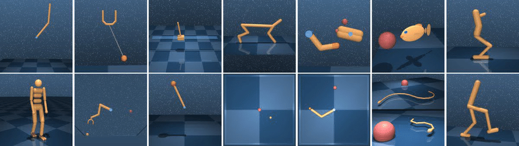
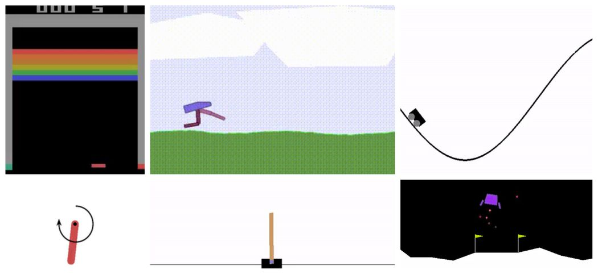
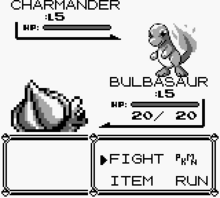

# gymnasium_environment
We have created a standardised general purpose gym that wraps the most common simulated environments used in reinforcement learning into a single easy to use place. This package serves as an example of how to develop and setup new environments - perticularly for the robotic environments. This package utilises the algorithms implemented in the repository https://github.com/UoA-CARES/cares_reinforcement_learning/ - consult that repository for algorithm implementations. 

## Installation Instructions


Follow the instructions at https://github.com/UoA-CARES/cares_reinforcement_learning/ to first install the CARES RL dependency first.

`git clone` this repository into your desired directory on your local machine

Run `pip3 install -r requirements.txt` in the **root directory** of the package

Install the environments dependent on pyboy here https://github.com/UoA-CARES/pyboy_environment

# Usage
This package is a basic example of running the CARES RL algorithms on OpenAI/DMCS/pyboy. 

## Running Training and Evaluation
The packagage is called using `run.py`. This takes in specific commands list below for training and evaluation purposes.

Use `python3 run.py -h` for help on what parameters are available for customisation.

### Train
The train command in the run.py script is used to initiate the training process for reinforcement learning models within specified gym environments. This command can be customized using various hyperparameters to tailor the training environment and the RL algorithm. You can use python "run.py train cli -h" to view all available options for customization and start a run directly through the terminal. This flexibility enables users to experiment with different settings and optimize their models effectively.

Specific and larger configuration changes can be loaded using python "run.py train config --data_path <PATH_TO_TRAINING_CONFIGS>", allowing for a more structured and repeatable training setup through configuration files.

```
python run.py train cli -h
python run.py train config --data_path <PATH_TO_TRAINING_CONFIGS>
```

### Resume (Experimental)
The resume command allows you to continue training from a previously saved checkpoint. This is useful if training was interrupted or if you want to further improve a model. You can specify the path to the checkpoint and resume training with your desired settings.

Note: to enable a training to be resumable you need to enable the "--save_train_checkpoints 1" when using the train command. Checkpoint saving does not default to true, this is because saving a checkpoint of the memory, and training parameters increases data storage on the HD - especially for image based learning. This is also an experimental feature and the "resume" does not set all parameters/evnrioments to the same state as before - this will change the training outcomes, it is not a true resume command. 

```
python run.py resume --data_path <PATH_TO_TRAINING_DATA> --seed <SEED_TO_RESUME>
```

### Evaluate
The evaluate command is used to re-run the evaluation loops from a prior training run - this will reproduce the evaluation graphs and data from a given training experiment. 

```
python run.py evaluate --data_path <PATH_TO_TRAINING_DATA>
```

### Test
The test command is used to run evaluation loops on a trained reinforcement learning model on the envrionment, users can load the trained model to evaluate how well the model performs on the given task with different seeds and over any number of episodes. 

```
python run.py test --data_path <PATH_TO_TRAINING_DATA> --seeds <LIST_OF_SEEDS> --episodes <NUM_EPISODES>
```


## Gym Environments
This package contains wrappers for the following gym environments:

#### Deep Mind Control Suite
The standard Deep Mind Control suite: https://github.com/google-deepmind/dm_control

```
python3 run.py train cli --gym dmcs --domain ball_in_cup --task catch TD3
```

<p align="center">
    
</p>

#### OpenAI Gymnasium
The standard OpenAI Gymnasium: https://github.com/Farama-Foundation/Gymnasium 

```
python run.py train cli --gym openai --task CartPole-v1 DQN

python run.py train cli --gym openai --task HalfCheetah-v4 TD3
```

<p align="center">
    
</p>

#### Game Boy Emulator
Environment running Gameboy games utilising the pyboy wrapper: https://github.com/UoA-CARES/pyboy_environment 

```
python3 run.py train cli --gym pyboy --task mario SACAE
```

<p align="center">
    
    
</p>

# Data Outputs
All data from a training run is saved into the directory specified in the `CARES_LOG_BASE_DIR` environment variable. If not specified, this will default to `'~/cares_rl_logs'`.

You may specify a custom log directory format using the `CARES_LOG_PATH_TEMPLATE` environment variable. This path supports variable interpolation such as the algorithm used, seed, date etc. This defaults to `"{algorithm}/{algorithm}-{domain_task}-{date}"`.

This folder will contain the following directories and information saved during the training session:

```text
├─ <log_path>
|  ├─ env_config.json
|  ├─ alg_config.json
|  ├─ train_config.json
|  ├─ *_config.json
|  ├─ ...
|  ├─ SEED_N
|  |  ├─ data
|  |  |  ├─ train.csv
|  |  |  ├─ eval.csv
|  |  ├─ figures
|  |  |  ├─ eval.png
|  |  |  ├─ train.png
|  |  ├─ models
|  |  |  ├─ model.pht
|  |  |  ├─ CHECKPOINT_N.pht
|  |  |  ├─ ...
|  |  ├─ videos
|  |  |  ├─ STEP.mp4
|  |  |  ├─ ...
|  ├─ SEED_N
|  |  ├─ ...
|  ├─ ...
```

# Plotting
The plotting utility in https://github.com/UoA-CARES/cares_reinforcement_learning/ will plot the data contained in the training data based on the format created by the Record class. An example of how to plot the data from one or multiple training sessions together is shown below.

Running 'python3 plotter.py -h' will provide details on the plotting parameters and control arguments. You can custom set the font size and text for the title, and axis labels - defaults will be taken from the data labels in the csv files.

```sh
python3 plotter.py -h
```

Plot the results of a single training instance

```sh
python3 plotter.py -s ~/cares_rl_logs -d ~/cares_rl_logs/ALGORITHM/ALGORITHM-TASK-YY_MM_DD:HH:MM:SS
```

Plot and compare the results of two or more training instances

```sh
python3 plotter.py -s ~/cares_rl_logs -d ~/cares_rl_logs/ALGORITHM_A/ALGORITHM_A-TASK-YY_MM_DD:HH:MM:SS ~/cares_rl_logs/ALGORITHM_B/ALGORITHM_B-TASK-YY_MM_DD:HH:MM:SS
```
